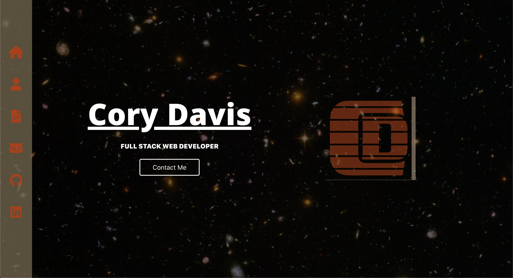
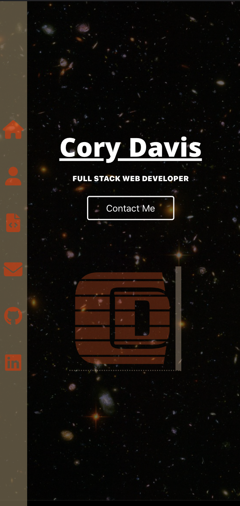

# North Texas Suzuki Association Website

[GITHUB PAGES LINK](https://cmd0160.github.io/react_portfolio/)

[GITHUB REPO](https://github.com/cmd0160/react_portfolio)

## Table of Contents

- [Description](#description-of-the-project)
- [Languages](#languages-used)
- [Technologies & Libraries](#technologies-and-libraries-used)
- [Features](#features)
- [Future Development](#future-development)
- [Team Members](#team-members)

## Description Of the Project

This is the repo for my React portfolio. It features some info about myself, recent projects and a contact page.

## Languages Used

- HTML
- CSS
- JavaScript

## Technologies and Libraries Used

- Font Awesome
- Framer Motion
- ReactJS
- EmailJS

## Features

- Custom Logo Design
- Side Navigation
- EmailJS Integration in contact page
- onClick project rotation on Project Page
- Fully responsive design considerations

## Future Development

- Framer Motion animation on the Home Page.
- Timer rotation for projects.
- Add icons for technologies on project page.

## Developer(s)

- **Cory Davis** - [Full Stack](https://github.com/cmd0160)

## Full Screen 

## Mobile
